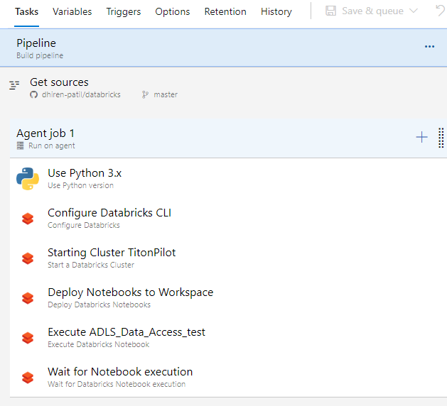

# DevOps - Azure Pipelines

#### Overview

Azure DevOps pipeline is an HP Codeway approved framework to use within
HP.  HP Codeway combines the pipeline capability with integration of HP
Enterprise Github and other HP provided software development tools to
provide CI/CD capabilities to developers.

Azure Pipelines is a cloud service that you can use to automatically
build and test your code project and make it available to other users.
It works with just about any language or project type.  Azure Pipelines
combines continuous integration (CI) and continuous delivery (CD) to
constantly and consistently test and build your code and ship it to any
target.

This wiki demonstrates how to enable  continuous integration and
continuous deployment using Azure pipeline.   

Typical software development concept applies here as well where
developer writes code in his favorite IDE then commits code to Azure
enterprise github.  The commit in the branch triggers a Azure Pipeline
job which builds on the Azure build agent and deploys code to the Azure
Databricks using APIs.

#### Reference: [[Azure Pipeline]{.underline}](https://docs.microsoft.com/en-us/azure/devops/pipelines/get-started/pipelines-get-started?view=azure-devops)

#### Prerequisite: 

-   HP Enterprise Github repository

-   Azure DevOps access

-   Azure Databricks workspace access with cluster run permission

#### ** **Pipeline setup instructions

1.  Generate personal token in github enterprise

    1.  Login to the Github enterprise

        1.  [[https://github.azc.ext.hp.com/]{.underline}](https://github.azc.ext.hp.com/)

    2.  Select your profile then select settings

        1.  {width="1.25in" height="2.59375in"}

    3.  Select Developer Settings, then Personal access tokens button on
        > the left

    4.  Select Generate token button.  Name the token then select needed
        > scopes and click Generate token button

        1.  Do not select full control scopes.  Limit the access to just
            > integrate into cicd pipeline

        2.  At minimum this scopes are required

            1.  repo, admin:repo_hook, read:user, user:email

        3.  {width="4.875in"
            > height="1.1145833333333333in"}

2.  Create github enterprise connection in Azure Devops

    1.  Login to the Azure DevOps portal

        1.  [[https://dhiren-patil.visualstudio.com/]{.underline}](https://dhiren-patil.visualstudio.com/)

    2.  Click on your project if you have multiple project in Azure
        > DevOps portal

    3.  Click on the Project settings button on the bottom left of
        > DevOps portal

    4.  Click on the GitHub connections under Boards section

        1.  {width="4.875in" height="1.75in"}

    5.  Click on the New connection button

    6.  Click on the link for the GitHub Enterprise Server.  DO NOT
        > click on the Connect your Github account button

        1.  {width="3.5625in"
            > height="2.6041666666666665in"}

    7.  Click on the Personal Access Token url under Alternative
        > authentication options

        1.  {width="4.875in" height="2.03125in"}

    8.  Enter the github enterprise URL

        1.  [[https://github.azc.ext.hp.com]{.underline}](https://github.azc.ext.hp.com/)

    9.  Then Enter the personal Token generated from your github account
        > in the 1-d above.  Then click Connect at the bottom of screen

        1.  {width="4.552083333333333in"
            > height="2.6041666666666665in"}

3.  Let\'s create the pipeline

    1.  Click on your project in the Azure DevOps portal

    2.  Click on Pipelines on the vertical menu on the left, then click
        > Pipelines in sub-menu

        1.  {width="3.2708333333333335in"
            > height="2.59375in"}

    3.  Click on New pipelines button on the top left of the screen

    4.  On the screen, click on the \"user the classic editor to create
        > a pipeline without YAML\" link at the bottom

        1.  If you have a YAML template, you can opt to continue to use
            > it with out classic editior

        2.  Classic editor allows drag and drop of task for your
            > pipeline

        3.  {width="2.3020833333333335in"
            > height="2.59375in"}

    5.  Select \"GitHub Enterprise Server\" as a source.  Select the
        > github repository and the branch where your code will be
        > checked in

        1.  {width="4.03125in"
            > height="2.6041666666666665in"}

    6.  Click continue

    7.  On the right side of the screen, you will see list of
        > templates.  Scroll down and select Empty pipeline template.

        1.  {width="4.875in"
            > height="0.4791666666666667in"}

    8.  We will use Ubuntu-18.04 in the Agent specification input.  Then
        > click on the Add a task to Agent job1

        1.  {width="4.875in"
            > height="2.2916666666666665in"}

    9.  This is where you will add all the components of the pipeline.
        > Your Get source stage should be at the top of the list

    10. First task after code check out from our repository should be to
        > install Python library

        1.  we will use Python 3.x task

    11. Let\'s search \"Databricks\" and add components by clicking Add
        > button

        1.  {width="4.875in"
            > height="2.4479166666666665in"}

        2.  Search following components and add as task to your pipeline

        3.  Maintain the sequence

        4.  {width="2.8645833333333335in"
            > height="2.6041666666666665in"}

    12. Click on the variables button on top of pipeline, Variable
        > groups, then click on Manage Variable groups button

        1.  {width="4.875in" height="1.5in"}

    13. Click on the +Variable Group button from top menu

        1.  {width="4.875in" height="0.9375in"}

    14. Give the variable group a name then add 4 variables as shown in
        > the image below.  This will ensure that your values such as
        > cluster id, personal tokens are encrypted and store securely
        > so it is not exposed in any logs or visible in plain sight

        1.  {width="4.25in"
            > height="4.166666666666667in"}

        2.  Click on the Save button to save the group

    15. Let\'s connect the variables to the task so the task can resolve
        > the variable value at the runtime

    16. Let\'s click on the first task of configure Databricks cluster
        > and add the variable in format shown in image

        1.  {width="4.145833333333333in"
            > height="4.84375in"}

    17. Click through all the tasks in your pipeline and add all the
        > required variables in format shown above in image.

        1.  Ensure that each task has a defined timeout value.  0
            > indicate infinite.  

            1.  Change the timeout value for each task from 0 to 6 
                > (mins).  That way we control a runaway pipeline

    18. After all the change, click on the save button to save the
        > pipeline

    19. Let\'s click on the Triggers button on your pipeline then
        > replicate the setup shown in the image below.

        1.  This ensure that anytime developers checks in his code to a
            > github repository and to a specified branch, this pipeline
            > is triggered to deploy the code

        2.  {width="4.875in"
            > height="1.8958333333333333in"}

4.  This should complete the pipeline setup.  There are lot of options
    > to enhance the pipeline.  Look through the available task for a
    > pipeline as well as options for each task and the pipeline itself
    > to enhance the pipeline to perform better

5.  Final step is the click on the Save&Queue button to run the pipeline

6.  If the pipeline fails, click on the jobs run number to view the
    > details and troubleshoot.

    1.  {width="4.84375in"
        > height="2.6041666666666665in"}
